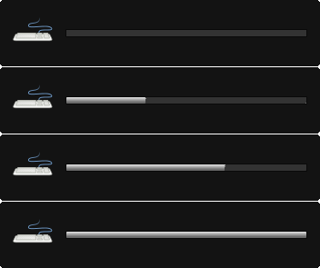

i3-kb-backlight
=========
[][license]

Keyboard backlight control and notifications for [i3wm].



## Installation

#### Requirements
* awk
* bc
* [upower]

#### Optional
* A [libnotify] compatible notification daemon such as [notify-osd] or [dunst]
* `notify-send` (provided by [libnotify]) or `dunstify` (provided by [dunst])

### Guide
Clone this repository: `git clone https://github.com/hastinbe/i3-kb-backlight.git ~/i3-kb-backlight`

Edit the following example and append it to your ~/.config/i3/config:

```
## Keyboard backlight control

# Path to backlight script
set $backlight_path ~/i3-kb-backlight

# Amount to increase/decrease brightness
set $brightness_step 1

bindsym XF86KbdBrightnessUp   exec $backlight_path/brightness -n -i $brightness_step
bindsym XF86KbdBrightnessDown exec $backlight_path/brightness -n -d $brightness_step
```
Reload i3 configuration by pressing `mod+Shift+r`

## Usage
Use your keyboard backlight brightness keys to increase or decrease your brightness. When notifications are enabled (`-n` flag) a popup will display the brightness level.

#### Notifications
Notifications are provided by [libnotify]. Any [libnotify] compatible notification daemon can be used for notifications. The most common are [notify-osd] and [dunst]. To disable notifications remove the `-n` option from the `bindsyms` in the example configuration below.

If you are using [dunst], you may optionally choose to use `dunstify` instead of `notify-send` by adding the `-y` option to the `bindsyms` in the example configuration below.

Expiration time of notifications can be changed using the `-e <time_in_milliseconds>` option. Default is 1500 ms. (Ubuntu's Notify OSD and GNOME Shell both ignore the expiration parameter.)

## License

`i3-kb-backlight` is released under [GNU General Public License v2][license]

Copyright (C) 1989, 1991 Free Software Foundation, Inc.

[dunst]: https://dunst-project.org
[i3wm]: https://i3wm.org
[libnotify]: https://developer.gnome.org/libnotify
[license]: https://www.gnu.org/licenses/gpl-2.0.en.html
[notify-osd]: https://launchpad.net/notify-osd
[upower]: https://upower.freedesktop.org
